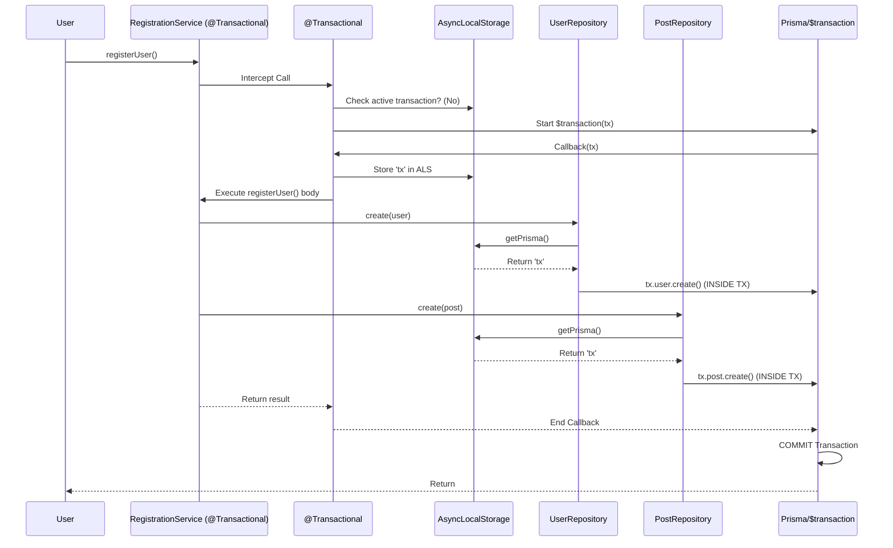

# Design Document: Implicit Repository Pattern & Transaction Management for Prisma (Node.js)

## 1. Overall Pattern

**Goal**: To replicate the "Developer Experience" of the Python `repository_sqlalchemy` library in a Node.js/TypeScript environment using Prisma.
**Core Philosophy**: "Implicit Context over Explicit Parameters". Developers should not need to pass transaction objects (`tx`) manually through their service layers.
**Mechanism**:

- Use Node.js **`AsyncLocalStorage`** (ALS) to store the active Prisma Transaction Client.
- Use **Decorators** (`@Transactional`) to manage transaction barriers and lifecycle.
- Use a **Base Repository** or **Dynamic Getter** pattern to ensure all database queries automatically hook into the active ALS context.
  - The HOF `runInTransaction` reuses the existing ALS client if one is already active to avoid accidental nested transactions.
  - The exported `prisma` proxy always routes to the correct client (transaction or root), so ad‑hoc queries stay safe.

## 2. File Responsibilities & Architecture

We will structure the library core into four main files to separate concerns.

### A. `src/lib/context.ts` (The State Manager)

**Responsibility**: Managing the lifecycle of the `AsyncLocalStorage`.

- **Key Components**:
  - `storage`: An instance of `AsyncLocalStorage<Prisma.TransactionClient>`.
  - `runInTransaction(txClient, callback)`: A helper to run a function within the scope of a specific transaction client.
  - `getTransactionClient()`: Returns the current transaction client from store, or `undefined` if none exists.

### B. `src/lib/prisma-manager.ts` (The Client Provider)

**Responsibility**: The gateway for obtaining the _correct_ Prisma Client.

- **Key Components**:
  - `getPrisma()`: The static accessor used by Repositories.
    - **Logic**:
      1. Check `context.getTransactionClient()`.
      2. If exists -> Return it (We are inside a `@Transactional` block).
      3. If null -> Return the global `rootPrismaClient`.

### C. `src/lib/decorators.ts` (The API Surface)

**Responsibility**: Providing the `@Transactional()` decorator for service methods.

- **Key Components**:
  - `Transactional()`: Method decorator.
    - **Logic**:
      1. Intercept the method call.
      2. Check if we are already in a transaction. If yes, just run the method (Nested Support).
      3. If no, start `prisma.$transaction(async (tx) => { ... })`.
      4. Inside the transaction callback, use `context.runInTransaction(tx, originMethod)`.

### D. `src/lib/base-repository.ts` (The Abstraction)

**Responsibility**: Providing standard CRUD operations that are context-aware and strongly typed via Prisma Generics.

- **Key Components**:
  - `abstract class BaseRepository<M extends Prisma.ModelName>`
  - `protected get delegate()`: Internal context-aware getter.
  - **Public Methods**:
    - `create(args)`
    - `findUnique(args)`
    - `findMany(args)`
    - `update(args)`
    - `delete(args)`

---

## 3. Simulation: The Execution Flow

**Scenario**: A `RegistrationService` creates a `User` and a `WelcomePost` atomically.



## 5. FAQ / Architectural Decisions

### Q: Can I define models as TypeScript Classes (Code-First)?

**No, this is a fundamental difference in Prisma.**

- **SQLAlchemy / TypeORM (Code-First)**: You define a class `User` in code, and the ORM generates the table from it.
- **Prisma (Schema-First)**: You define the table in `schema.prisma`, and the ORM generates the TypeScript types/interfaces from it.
- **Why?**: Prisma creates a "Single Source of Truth" that is independent of your programming language. This allows for better performance (the Rust engine reads the schema) and perfect type safety without runtime reflection overhead.

### Q: Do I need `@Transactional` for every method?

**NO.**

- **Single Operations**: Just call `this.userRepo.create(...)`. It is automatically atomic (standard Prisma behavior). You do **not** need the decorator.
- **Multiple Operations**: Use `@Transactional` **only** when you need to group multiple repository calls into a single Unit of Work (so they commit/rollback together).
This matches the Python `repository-sqlalchemy` design: "Implicitly atomic by default, explicitly transactional when needed."

### Q: Do I need to initialize Prisma explicitly?

**Only if you want eager connection or SQLite WAL mode.**

- By default, Prisma connects lazily on first query.
- If you want to force a connection or enable WAL, call `initializePrisma({ enableWAL: true })` during app startup.

### Q: How does `@Transactional` work in Node.js?

In TypeScript, when you enable `experimentalDecorators`, the `@Transactional` annotation is compiled into a **Higher-Order Function** that wraps your original method.

- **Runtime**: It receives the method descriptor. We replace `descriptor.value` with a new function that:
  1. Checks if a transaction is already active.
  2. If not, creates a new one via `prisma.$transaction`.
  3. Runs the original method inside that scope.
- **Support**: While technically "experimental" in TypeScript, this pattern is the **standard** in major frameworks like **NestJS**, **TypeORM**, and **Angular**. It is robust and production-ready for TypeScript projects.

### Q: Why not use `.delegate` directly?

We want to mimic the clean API of the Python implementation. Exposing `this.repository.delegate.create` is "leaky" (it exposes the raw Prisma client) and verbose.
Instead, `BaseRepository` will strictly implement standard CRUD methods (`create`, `findById`, etc.), internally managing the context-aware delegate. This provides a cleaner, stricter "Repository Pattern" abstraction.

---

## 4. Usage Example

Here is how the end-user (developer) uses this library. Note the clean separation of business logic and infrastructure.

### The Setup (Repository Layer)

```typescript
// user.repository.ts
import { BaseRepository, Models } from "repository_prisma";

// STRICT TYPING: No string literal needed.
export class UserRepository extends BaseRepository.forModel(Models.User) {
  // Model name mapped from Models.User -> "user"
}
```

### The Business Logic (Service Layer)

```typescript
// registration.service.ts
import { Transactional } from "./lib/decorators";
import { UserRepository } from "./user.repository";
import { PostRepository } from "./post.repository";

export class RegistrationService {
  private userRepo = new UserRepository();
  private postRepo = new PostRepository();

  // MAGIC HAPPENS HERE: The decorator handles the transaction connection
  @Transactional()
  async registerUser(email: string, initialPost: string) {
    // 1. Create User
    // CLEAN API: Standard CRUD methods
    const user = await this.userRepo.create({ data: { email } });

    // 2. Create Post
    // Automatically joins the SAME transaction
    await this.postRepo.create({
      data: {
        title: initialPost,
        authorId: user.id,
      },
    });

    // If anything fails here, BOTH operations rollback.
    return user;
  }
}
```
