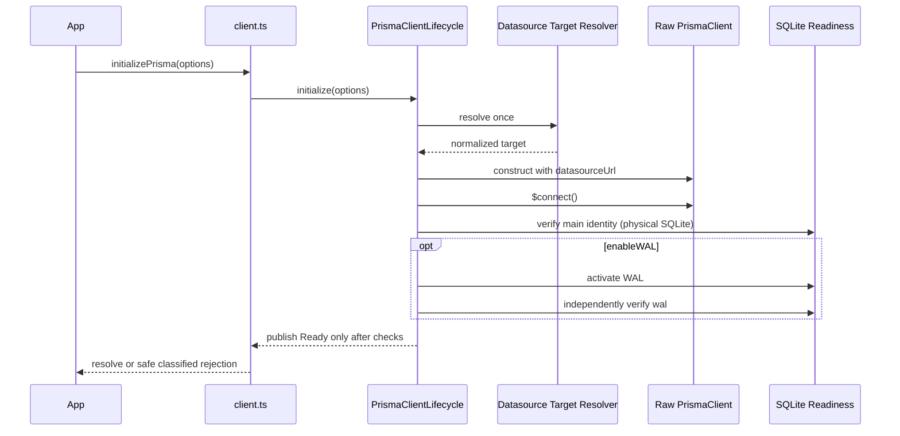
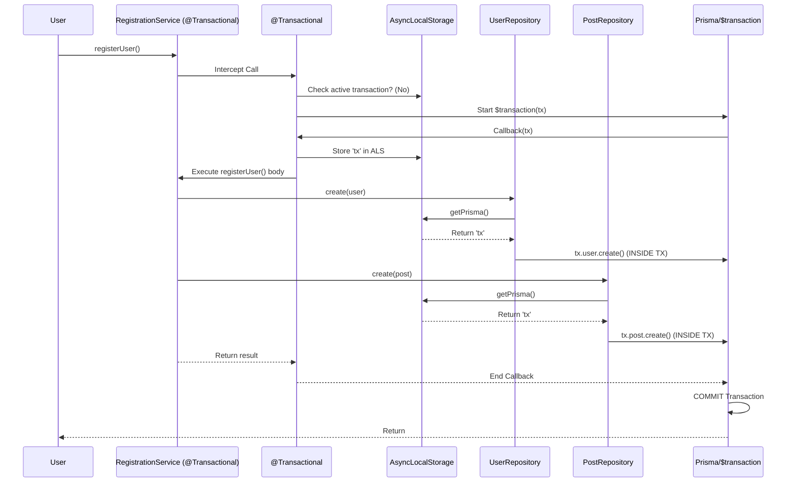

# Design Document: Implicit Repository Pattern & Transaction Management for Prisma (Node.js)

## 1. Overall Pattern

**Goal**: To replicate the "Developer Experience" of the Python `repository_sqlalchemy` library in a Node.js/TypeScript environment using Prisma.
**Core Philosophy**: "Implicit Context over Explicit Parameters". Developers should not need to pass transaction objects (`tx`) manually through their service layers.
**Mechanism**:

- Use Node.js **`AsyncLocalStorage`** (ALS) to store the active Prisma Transaction Client.
- Use **Decorators** (`@Transactional`) to manage transaction barriers and lifecycle.
- Use a **Base Repository** or **Dynamic Getter** pattern to ensure all database queries automatically hook into the active ALS context.
  - The HOF `runInTransaction` reuses the existing ALS client if one is already active to avoid accidental nested transactions.
  - The HOF accepts optional Prisma interactive-transaction settings only at the outer
    transaction boundary. Prisma remains responsible for enforcing them.
  - The exported `prisma` proxy always routes to the correct client (transaction or root), so ad‑hoc queries stay safe.

## 2. File Responsibilities & Architecture

The library has two cooperating authorities: `AsyncLocalStorage` owns the active transaction client,
and `PrismaClientLifecycle` owns the one raw non-transaction root client. Callers above these
boundaries use the exported forwarding surfaces rather than combining a facade with lifecycle
internals.

### A. `src/lib/context.ts` (The State Manager)

**Responsibility**: Managing the lifecycle of the `AsyncLocalStorage`.

- **Key Components**:
  - `prismaContext`: An instance of `AsyncLocalStorage<Prisma.TransactionClient>`.
  - `runInTransactionContext(txClient, callback)`: An internal helper to run a
    function within the scope of a specific transaction client.
  - `runInTransaction(callback, options?)`: The public HOF. It passes an explicitly
    supplied `RunInTransactionOptions` object unchanged to Prisma when opening the
    outer interactive transaction. Omitting options preserves Prisma's one-argument
    call and defaults.
  - `getTransactionClient()`: Returns the current transaction client from store, or `undefined` if none exists.

`RunInTransactionOptions` contains only `maxWait`, `timeout`, and
`isolationLevel`. Prisma owns wait behavior, timers, isolation enforcement, commit,
and rollback. When a transaction is already active, nested HOF calls reuse its ALS
client and ignore inner options; the outer boundary owns configuration and atomicity.

### B. `src/lib/prisma-manager.ts` (The Client Provider)

**Responsibility**: The gateway for obtaining the _correct_ Prisma Client.

- **Key Components**:
  - `getPrismaClient()`: The accessor used by repositories.
    - **Logic**:
      1. Check `context.getTransactionClient()`.
      2. If exists -> Return it (We are inside a `@Transactional` block).
      3. If null -> Return the lifecycle-backed `rootPrismaClient` forwarding boundary.

### C. `src/lib/decorators.ts` (The API Surface)

**Responsibility**: Providing the `@Transactional()` decorator for service methods.

- **Key Components**:
  - `Transactional()`: Method decorator.
    - **Logic**:
      1. Intercept the method call.
      2. Check if we are already in a transaction. If yes, just run the method (Nested Support).
      3. If no, start `prisma.$transaction(async (tx) => { ... })`.
      4. Inside the transaction callback, use `context.runInTransaction(tx, originMethod)`.

### D. `src/lib/base-repository.ts` (The Abstraction)

**Responsibility**: Providing standard CRUD operations that are context-aware and strongly typed via Prisma Generics.

- **Key Components**:
  - `abstract class BaseRepository<M extends Prisma.ModelName>`
  - `protected get delegate()`: Internal context-aware getter.
  - **Public Methods**:
    - `create(args)`
    - `findUnique(args)`
    - `findMany(args)`
    - `update(args)`
    - `delete(args)`

### E. `src/lib/client.ts` and `src/lib/client/lifecycle.ts` (Root Lifecycle)

**Responsibility**: `client.ts` is the thin public facade; `PrismaClientLifecycle` is the sole raw
root-client and lifecycle owner.

- Resolve one explicit datasource target and pass it through `PrismaClient({ datasourceUrl })`.
- Construct and disconnect the raw root client only inside the lifecycle owner.
- Resolve query logging at construction through `src/lib/client/logging-policy.ts`.
  The default levels are `info`, `warn`, and `error`; `query` is appended only when
  `PRISMA_LOG_QUERIES` is explicitly truthy or `initializePrisma({ logQueries: true })`
  is supplied. The typed option takes precedence over the environment flag.
- Capture the effective logging policy in every lifecycle state carrying the raw root
  client. A differing later typed policy rejects with `LOGGING_POLICY_CONFLICT` until
  `shutdownPrisma()` establishes a new binding boundary.
- Track lifecycle state as one discriminated union: `Idle`, `LazyBound`, `Initializing`, `Ready`,
  `Failed`, or `ShuttingDown`.
- Keep a candidate private until connection and required SQLite checks pass.
- Reject access during initialization, failure, or shutdown with `CLIENT_NOT_READY`.
- Share an identical in-flight initialization request; reject different target/readiness requests.
- Clear target, client, readiness, failure, and in-flight authority after shutdown even if disconnect
  itself fails.

The related internal files remain subordinate to this owner:

- `client/datasource-target.ts` selects, classifies, and normalizes the target. Physical SQLite
  relative paths are `process.cwd()`-relative.
- `client/sqlite-readiness.ts` owns `PRAGMA database_list`, WAL activation, and the independent
  journal-mode verification. It cannot publish or disconnect a client.
- `client/initialization-error.ts` owns safe stable codes/messages and guarded opt-in diagnostics. It
  does not log raw causes.

The package facade and Prisma CLI configuration do not import `dotenv/config` or load
`.env` files. Applications, scripts, and CI own environment provisioning; the library
reads already-present values only when resolving a datasource or constructing a client.
This behavior-only hardening changes no schema, migration, or persisted-data
representation, so existing consumer databases are directly usable without migration.

### Package ESM/CommonJS Boundary

The package exports separate ESM and CommonJS artifacts through the existing `exports.import`
and `exports.require` conditions. Because `@prisma/client` is a CommonJS-generated external peer,
ESM source must consume it through the default CommonJS namespace rather than named runtime
imports, which rely on Node's heuristic named-export detection. The lifecycle owner destructures
`PrismaClient` for raw client construction, and the model-value owner destructures `Prisma` for
`Models`; each keeps a separate aliased `import type` binding for TypeScript-only references.

All other Prisma references in package source use explicit `import type`, so declarations retain
the existing contracts without adding runtime peer edges. The package does not add a fallback,
`createRequire` path, compatibility adapter, or peer-range change. Package validation includes a
synthetic dynamic CommonJS-peer ESM probe in addition to the installed generated-peer smoke.

### F. `src/lib/forwarding-proxy.ts` and `src/lib/prisma-proxy.ts` (Access Routing)

**Responsibility**: Preserve Prisma-shaped public access without leaking a retained raw root or ALS
delegate.

Property inspection may resolve the current surface, but returned model-delegate and method handles
are forwarding wrappers. When called, a wrapper resolves the current root/transaction owner again and
uses `Reflect.apply` with that owner as `this`. The proxy is explicitly non-thenable. Root `$connect`
and `$disconnect` route to lifecycle initialization and shutdown.

Prisma APIs that return caller-owned client-like surfaces (for example `$extends`) and already-invoked
Prisma promises are outside revocation scope; the lifecycle guarantee applies to the exported
forwarding boundaries and pre-invocation handles captured from them.

---

## 3. Execution Flows

### Root Initialization and SQLite Readiness


```mermaid
sequenceDiagram
    participant App
    participant Facade as client.ts
    participant Lifecycle as PrismaClientLifecycle
    participant Target as Datasource Target Resolver
    participant Prisma as Raw PrismaClient
    participant SQLite as SQLite Readiness

    App->>Facade: initializePrisma(options)
    Facade->>Lifecycle: initialize(options)
    Lifecycle->>Target: resolve once
    Target-->>Lifecycle: normalized target
    Lifecycle->>Prisma: construct with datasourceUrl
    Lifecycle->>Prisma: $connect()
    Lifecycle->>SQLite: verify main identity (physical SQLite)
    opt enableWAL
      Lifecycle->>SQLite: activate WAL
      Lifecycle->>SQLite: independently verify wal
    end
    Lifecycle-->>Facade: publish Ready only after checks
    Facade-->>App: resolve or safe classified rejection
```

`enableWAL: true` is fail-closed. A connection, identity, activation, or verification failure
disconnects the candidate, moves the lifecycle to `Failed`, invokes only explicitly registered
diagnostic callbacks with the raw cause, and rejects with a safe `PrismaInitializationError`.

### Transaction Routing

**Scenario**: A `RegistrationService` creates a `User` and a `WelcomePost` atomically.


```mermaid
sequenceDiagram
    participant User
    participant Service as RegistrationService (@Transactional)
    participant Decorator as @Transactional
    participant Context as AsyncLocalStorage
    participant UserRepo as UserRepository
    participant PostRepo as PostRepository
    participant DB as Prisma/$transaction

    User->>Service: registerUser()
    Service->>Decorator: Intercept Call
    Decorator->>Context: Check active transaction? (No)
    Decorator->>DB: Start $transaction(tx)

    DB->>Decorator: Callback(tx)
    Decorator->>Context: Store 'tx' in ALS
    Decorator->>Service: Execute registerUser() body

    Service->>UserRepo: create(user)
    UserRepo->>Context: getPrisma()
    Context-->>UserRepo: Return 'tx'
    UserRepo->>DB: tx.user.create() (INSIDE TX)

    Service->>PostRepo: create(post)
    PostRepo->>Context: getPrisma()
    Context-->>PostRepo: Return 'tx'
    PostRepo->>DB: tx.post.create() (INSIDE TX)

    Service-->>Decorator: Return result
    Decorator-->>DB: End Callback
    DB->>DB: COMMIT Transaction
    DB-->>User: Return
```

## 5. FAQ / Architectural Decisions

### Q: Can I define models as TypeScript Classes (Code-First)?

**No, this is a fundamental difference in Prisma.**

- **SQLAlchemy / TypeORM (Code-First)**: You define a class `User` in code, and the ORM generates the table from it.
- **Prisma (Schema-First)**: You define the table in `schema.prisma`, and the ORM generates the TypeScript types/interfaces from it.
- **Why?**: Prisma creates a "Single Source of Truth" that is independent of your programming language. This allows for better performance (the Rust engine reads the schema) and perfect type safety without runtime reflection overhead.

### Q: Do I need `@Transactional` for every method?

**NO.**

- **Single Operations**: Just call `this.userRepo.create(...)`. It is automatically atomic (standard Prisma behavior). You do **not** need the decorator.
- **Multiple Operations**: Use `@Transactional` **only** when you need to group multiple repository calls into a single Unit of Work (so they commit/rollback together).
This matches the Python `repository-sqlalchemy` design: "Implicitly atomic by default, explicitly transactional when needed."

### Q: Do I need to initialize Prisma explicitly?

**Only if you want eager connection, verified SQLite identity, or strict SQLite WAL readiness.**

- By default, Prisma connects lazily on first query.
- If you want startup proof, call `initializePrisma(...)` and await it before serving traffic.
- A non-empty `datasourceUrl` is authoritative. Otherwise the documented environment precedence is
  resolved once and still passed explicitly to Prisma.
- `enableWAL: true` supports only physical SQLite and resolves only after WAL is verified.
- Switching a bound target requires `await shutdownPrisma()` first.

### Q: How does `@Transactional` work in Node.js?

In TypeScript, when you enable `experimentalDecorators`, the `@Transactional` annotation is compiled into a **Higher-Order Function** that wraps your original method.

- **Runtime**: It receives the method descriptor. We replace `descriptor.value` with a new function that:
  1. Checks if a transaction is already active.
  2. If not, creates a new one via `prisma.$transaction`.
  3. Runs the original method inside that scope.
- **Support**: While technically "experimental" in TypeScript, this pattern is the **standard** in major frameworks like **NestJS**, **TypeORM**, and **Angular**. It is robust and production-ready for TypeScript projects.

### Q: Why not use `.delegate` directly?

We want to mimic the clean API of the Python implementation. Exposing `this.repository.delegate.create` is "leaky" (it exposes the raw Prisma client) and verbose.
Instead, `BaseRepository` will strictly implement standard CRUD methods (`create`, `findById`, etc.), internally managing the context-aware delegate. This provides a cleaner, stricter "Repository Pattern" abstraction.

---

## 4. Usage Example

Here is how the end-user (developer) uses this library. Note the clean separation of business logic and infrastructure.

### The Setup (Repository Layer)

```typescript
// user.repository.ts
import { BaseRepository, Models } from "repository_prisma";

// STRICT TYPING: No string literal needed.
export class UserRepository extends BaseRepository.forModel(Models.User) {
  // Model name mapped from Models.User -> "user"
}
```

### The Business Logic (Service Layer)

```typescript
// registration.service.ts
import { Transactional } from "./lib/decorators";
import { UserRepository } from "./user.repository";
import { PostRepository } from "./post.repository";

export class RegistrationService {
  private userRepo = new UserRepository();
  private postRepo = new PostRepository();

  // MAGIC HAPPENS HERE: The decorator handles the transaction connection
  @Transactional()
  async registerUser(email: string, initialPost: string) {
    // 1. Create User
    // CLEAN API: Standard CRUD methods
    const user = await this.userRepo.create({ data: { email } });

    // 2. Create Post
    // Automatically joins the SAME transaction
    await this.postRepo.create({
      data: {
        title: initialPost,
        authorId: user.id,
      },
    });

    // If anything fails here, BOTH operations rollback.
    return user;
  }
}
```
